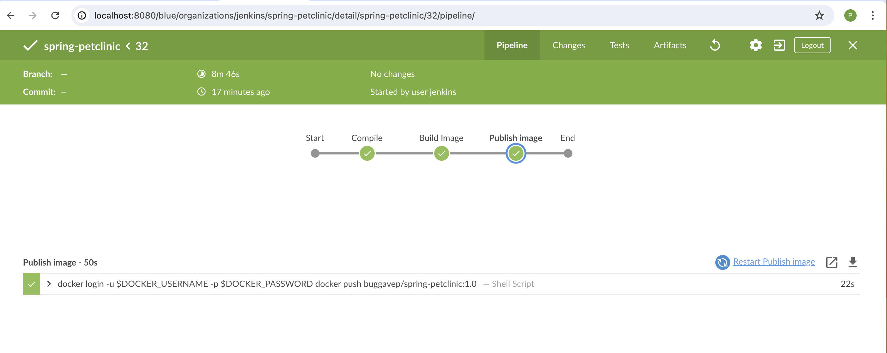
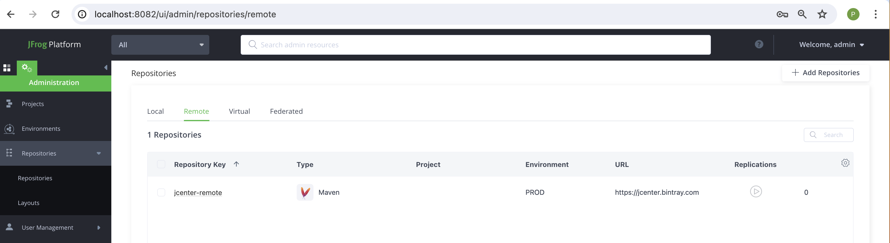
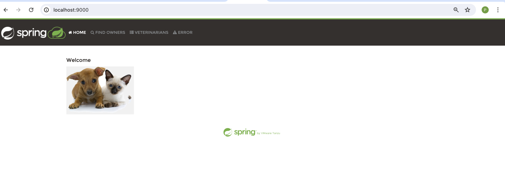

## Build Dockerfile
**CI/Dockerfile**

Configured to Jenkinsfile as build agent.
```bash
docker build -f CI/Dockerfile buggavep/sample-devops:9.0 .
```

## To compile locally
```bash
docker run -it --entrypoint=/bin/bash -v spring-petclinic:/home/jenkins/spring-petclinic -v /var/run/docker.sock:/var/run/docker.sock buggavep/sample-devops:9.0

cd spring-petclinic

./mvnw clean package

./mvnw spring-boot:build-image
```

## To Start the Application
```bash
docker run -d -p 9000:8080 buggavep/spring-petclinic:1.0
```

## Jenkins Dashboard

## Jenkins Build Configurations
[Setup Jenkins](https://www.jenkins.io/doc/book/installing/)
**CI/Jenkinsfile**


## Dependency Management
[Configure Jfrog artifactory](https://jfrog.com/start-free/install/)
Setup remote repostiory jcenter-remote
 
Update pom.xml file
```bash
<repository>
    <id>jcenter-remote</id>
    <url>http://localhost:8081/artifactory/jcenter-remote</url>
</repository>
```

## Build Agent
Light weight container installed with JDK 17 and docker to compile the app, package it and push it to docker.io regsitry.

```
agent {
    docker {
        image 'buggavep/sample-devops:1.0'
        args '-v /var/run/docker.sock:/var/run/docker.sock -u root'
    }
}
```

## Compile and package
Command to build the application, clean is lifecycle phase and removes the existing targets whereas package compiles the source code, runs any tests, and packages the compiled code and resources into a distributable format, JAR archive.
```
#!/usr/bin/bash
./mvnw clean package
```

## Build Image
Uses spring boot plugin to build the dockerimage and the image will be named according to the value provided.
```
#!/usr/bin/bash
./mvnw spring-boot:build-image -Dspring-boot.build-image.imageName=${DOCKER_IMAGE_NAME}
```

## Publish Image
Configure credentials of [Docker.io](https://hub.docker.com/) in Jenkins credential manager and retrieve the credentials to publish the image to registry.
```
docker login -u $DOCKER_USERNAME -p $DOCKER_PASSWORD
docker push ${DOCKER_IMAGE_NAME}
```

## Run the application
```
docker run -d -p 9000:8080 buggavep/spring-petclinic:1.0
```
Applicaiton is accessible at **http://localhost:9000/***
